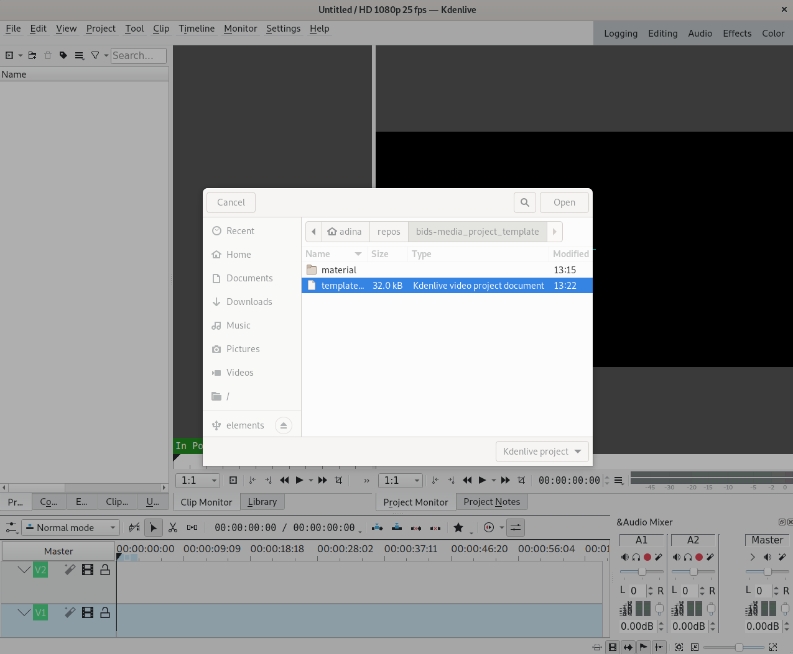
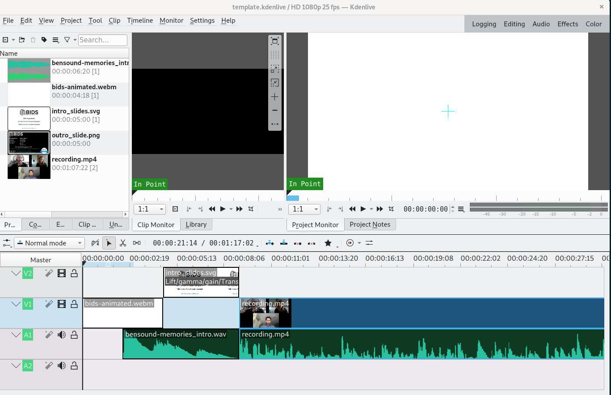

# BIDS youtube and podcast

## Requirements

Video editing done with [kdenlive](https://kdenlive.org/en/).

Audio editing with [audacity](https://www.audacityteam.org/).

Post-montage automated sound editing done with
[Auphonic](https://auphonic.com/).

Edit right access to:

- the
  [BIDS youtube channel](https://www.youtube.com/channel/UCxZUcYfd_nvIVWAbzRB1tlw/featured)
- the [BIDS anchor podcast channel](https://anchor.fm/bids-maintenance)

## Inputs

- source video material stored on this
  [google drive](https://drive.google.com/drive/folders/1hQ3Ng5DJOOqYvFFinFAxoik-6NO5Xnkw?usp=sharing)
- "template" intro and outro slides are in the same folder

## Step by step

### Get this template

1. start a new project:

- if you don't need version control: by downloading this template (click on
  `Code --> Download ZIP`)

- if you need version control (in case several people need to work on it): by
  creating a new repository by clicking on `Use the template` and the clone the
  new repository

### Add your own material

1. The file `template.kdenlive` contains a basic [kdenlive](https://kdenlive.org/en/)
   project to help you get started. Open it in kdenlive:

1. This should preload a generic intro sequence and a few placeholder files.
   The introduction with a logo and a jingle should not need changes.

1. The placeholder files are an intro-slide (`material/intro_slides.svg`) and a recording
   (`recording.mp4`). Replace these files with your own versions.

   - create / update the intro slide with a tool of your choice, or online from
   [these slides](https://docs.google.com/presentation/d/19-LQjDTDPXg0N8Z0LVH6ZyG0GaaiuactHIpuXTmPiQ8/edit?usp=sharing)

   - Note that slides can be saved individually
     `File --> Download --> SVG image (.svg, current slide)`

   - save your recording in the `material/` directory. Do not version control it, is is
     probably very big :)

1. If this project is for a youtube / podcast episode, you can rename the template:
   `episode-[episode number]_title_here.kdenlive`

### Adjust the template to your material

1. When you replaced the place holder files with identical names, the project files
   in kdenlive should have updated themselves automatically. If you have used other
   file names, you can add them as clips.

   1. Make sure that your new intro slide replaces the placeholder intro slide
   1. Make sure that your recording replaces the placeholder recording
   1. Crop the recording, if necessary
   1. eventually do any other editing (for example: remove long pauses...)

1. render the video: `episode-[episode number]\_title_here.mp4`

   1. Click `Render --> Render to File`

1. extract the soundtrack of the video:
   `episode-[episode number]\_title_here.wav`

   1. open `.mp4` with audacity and `File --> Extract as .wav`

1. eventually do a simple noise removal on the soundtrack

   <!-- TODO describe more for normal human beings -->

1. do sound leveling of the soundtrack with [Auphonic](https://auphonic.com/):
   `episode-[episode number]\_title_here.mp3`

   - Click on `New production` then `Browse...` to select the file to process.
   - Tick `Noise and Hum Reduction` at the bottom of the page
   - Click `Start Production`
   - Once the file is uploaded and processed you should get an email
     notification with a linkg to download the MP3 output.

1. replace old sound track with the new MP3 one.

1. eventually add any extra "effects" (for example some fade to / out of black)

1. re-render the video

1. upload the video to youtube but do not publish yet

   1. update video_description

   1. update metadata & license

      - video tags: `brain`, `BIDS`,
      - category: `science and technology`
      - license: creative commons - attribution

   1. add eventual extra video links on the outro slide

1. send link to speakers in the video to get their approval

1. publish on youtube

1. upload mp3 to anchor

## Issues and ideas for improvements

- ensure that template works with relative paths for the "clips" in `material`

- create an outro GIF of a scroll of all BIDS contributors

## References

Podcast editing wiki:

- https://osf.io/exu5h/
- https://doi.org/10.1016/j.tics.2020.10.003
